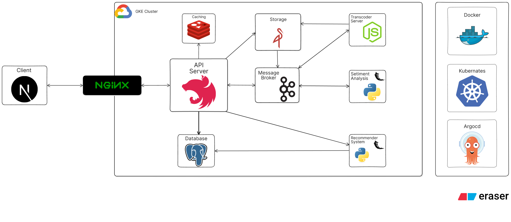
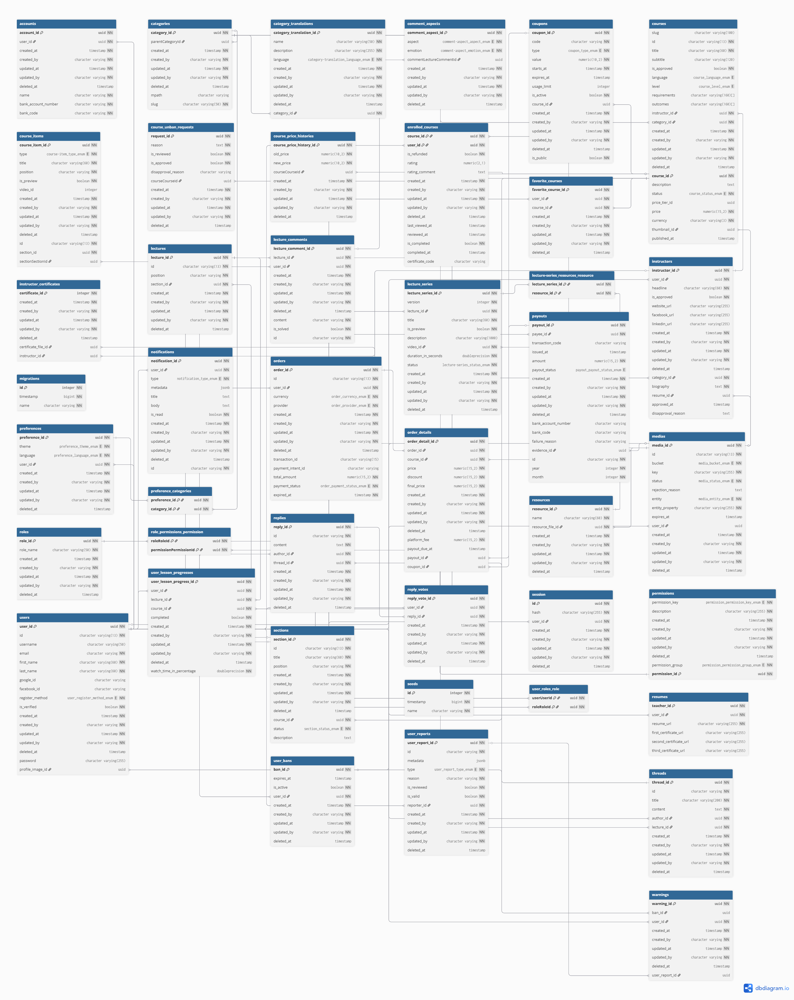
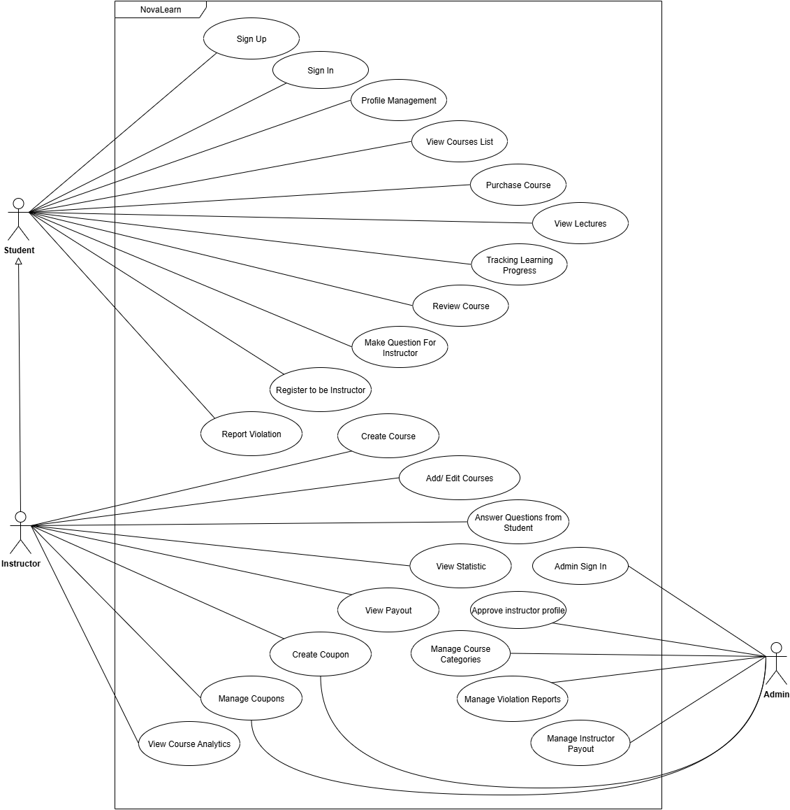

<h1 align="center">
  <a href="https://nestjs.com/" target="blank"></a>
  <a href="https://typeorm.io/" target="blank"></a>
  <a href="https://www.postgresql.org/" target="blank"></a>
  <a href="https://jestjs.io/" target="blank"></a>
  <a href="https://prettier.io/" target="blank"></a>
  <a href="https://eslint.org/" target="blank"></a>
</h1>

<br />
<div align="center">
    

  <h3 align="center">Nova Learn Backend</h3>

  <p align="center">
    An AI-powered E-learning platform focused on enhancing learning quality through data-driven course improvements, implements Aspect-Based Sentiment Analysis to analyze student feedback, providing instructors with actionable insights for content refinement.
    <br />
    <a href="https://github.com/KhoiMaiDinh/ELearning_BE/tree/main/docs"><strong>Explore the docs »</strong></a>
    <br />
    <br />
    <a href="https://github.com/KhoiMaiDinh/ELearning_BE/issues/new?labels=bug&template=bug-report---.md">Report Bug</a>
    &middot;
    <a href="https://github.com/othneildrew/Best-README-Template/issues/new?labels=enhancement&template=feature-request---.md">Request Feature</a>
  </p>
</div>

<details>
  <summary>Table of Contents</summary>
  <ol>
    <li>
      <a href="#overview">Overview</a>
    </li>
    <li>
      <a href="#system-architecture">System Architecture</a>
    </li>
    <li>
      <a href="#getting-started">Getting Started</a>
    </li>
    <li><a href="#documentation">Documentation</a></li>
    <li><a href="#license">License</a></li>
    <li><a href="#contact">Contact</a></li>

  </ol>
</details>

## Overview

This repository contains the backend API server component of the E-learning platform. The complete system architecture includes several microservices working together to deliver a comprehensive learning experience.

## System Architecture



### Distributed System

- **API Server**: Main application server handling HTTP requests ([GitHub](https://github.com/KhoiMaiDinh/ELearning_BE))
- **Transcoding Server**: Handles on-demand video transcoding, integrates with Google Cloud Storage or Minio ([GitHub](https://github.com/KhoiMaiDinh/ELearning_VideoTranscoder))
- **Sentiment Analysis Server**: Aspect-based sentiment analysis for lecture comments & dashboards (PhoBert) ([GitHub](https://github.com/KhoiMaiDinh/ELearning_Aspect-Based_Sentiment_Analysis))
- **Recommender System**: Personalized course recommendations using collaborative + content-based ML ([GitHub](https://github.com/KhoiMaiDinh/ELearning_Recommender))
- **Infrastructure**: GitOps-based infrastructure management, ArgoCD, GKE deployments ([GitHub](https://github.com/KhoiMaiDinh/ELearning_Infrastructure))

---

### Other Components

- **User Frontend**: React-based web interface for students and instructors ([GitHub](https://github.com/KhoiMaiDinh/ELearning_Frontend))
- **Admin Frontend**: React-based web interface for platform administrators ([GitHub](https://github.com/KhoiMaiDinh/ELearning_Admin))

### Database Design



[View further database documentation →](docs/database.md)

### Usecase Design



### Key Features

[View complete feature documentation →](docs/features.md)

### Technology Stack

- **Framework**: NestJS (TypeScript)
- **Database**: PostgreSQL
- **Caching**: Redis
- **Message Queue**: Kafka
- **Background Jobs**: BullMQ
- **Storage**: MinIO/S3
- **Authentication**: JWT
- **Documentation**: Swagger/OpenAPI
- **Testing**: Jest, Supertest
- **Deployment**: Docker, Kubernetes, Google Cloud Platform

## Getting Started

### Installation

1. Clone the repository

   ```bash
   git clone https://github.com/KhoiMaiDinh/ELearning_BE.git
   ```

2. Install dependencies

   ```bash
   pnpm install
   ```

3. Set up environment variables

   ```bash
   cp .env.example .env
   # Edit .env with your configuration
   ```

### Running the Application

```bash
    # development
  $ pnpm start

  # watch mode
  $ pnpm start:dev

  # production mode
  $ pnpm start:prod
```

### Running with Docker

```bash
 # Start with dev mode
 docker compose -f docker-compose.local.yml up --build
 # OR
 # Start with prod mode
 docker compose -f docker-compose.yml up --build
```

## Documentation

Please read the [docs](docs/README.md). It contains the details about the project structure, conventions, and more.

## License

This project is licensed under the [MIT License](LICENSE).

## Contact

For questions or suggestions, please contact us at:

- Email: khoimd.dev@gmail.com
- Phone Number: +84 905636640
